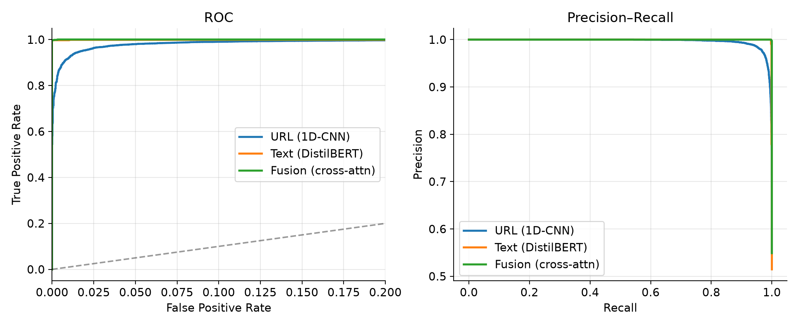
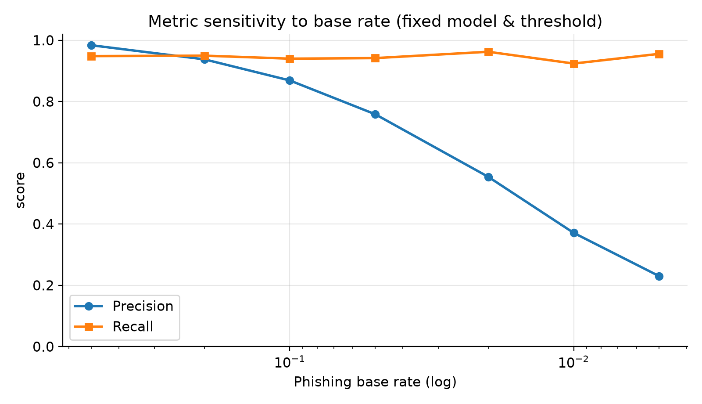

# PhishNet: A Cross-Modal Attention Framework for Explainable Real-Time Phishing Detection

<b>Harsh Raj, Aryan Kumar, Ayush Prajapati, Ujjawal Jain</b> 
School of Computer Science, University of Petroleum and Energy Studies, Dehradun, India 
Mentor: Dr. Swati Rastogi

---

## Abstract

Phishing is still the entry point for a large share of security incidents, and
the campaigns that get through are increasingly the ones built to defeat
single-signal detectors. A URL blacklist misses a domain registered an hour ago.
A lexical model misses a clean-looking link on a compromised host. A visual
matcher cannot tell a pixel-perfect clone from the page it copies, and a text
classifier has almost nothing to read on a page that is mostly image. We present
PhishNet, a detector that reads three signals together: the URL as a character
sequence, the rendered page as an image, and the message text. It fuses them with
a cross-modal attention mechanism so that each signal is interpreted in the
context of the others. We evaluate on real, live-collected corpora under a
domain-disjoint split, and we report the number most phishing papers leave out:
how the model behaves at a deployment-realistic base rate rather than on a balanced
test set. Our headline finding on fusion is a corrective one. Adding modalities
helps substantially and robustly. F1 rises from 0.968 (URL alone) to 0.991 (all
three), a gain far outside run-to-run noise. But the fusion *mechanism* does not
matter: a single run suggested cross-modal attention beat naive concatenation by
5.5× on false-positive rate, and across four independent runs that advantage disappeared
(F1 0.9949 ± 0.0029 vs 0.9944 ± 0.0008; each wins on FPR in half the runs). We
report this because attention-over-concatenation superiority is often claimed on
single runs in the multimodal phishing literature; with error bars, on this task,
it does not hold. The visual branch generalises to
brands unseen in training from a single enrolment image, and widening the brand
index from 10 to 24 lifts zero-shot F1 from 0.59 to 0.78. We report that figure
with a caveat we established by probing the encoder attack-by-attack: our rendered
corpus encodes brand identity largely in colour, so the visual numbers bound what
that corpus can show rather than demonstrating structural robustness (Section 6). We also quantify a data-recency gap the field usually inherits
silently: a text model trained only on the standard pre-2009 email corpora scores
*below chance* (ROC-AUC 0.31) on current-theme lures, and we show that adding a
recent-lure set restores competence without harming classic-email accuracy. Every verdict carries a SHAP attribution over interpretable URL
features and a Grad-CAM heatmap over the screenshot, and the system ships as a
Chrome extension that scans client-side. That last choice is deliberate, since
2026 phishing kits cloak aggressively against server-side crawlers.

**Keywords:** phishing detection, multimodal learning, cross-modal attention,
explainable AI, Siamese networks, browser security.

---

## 1. Introduction

The Anti-Phishing Working Group recorded 971,181 unique phishing attacks in the
first quarter of 2026, a 13.8% rise over the 853,244 seen in the last quarter of
2025 [1]. The same report notes a structural shift in *who* is targeted: the
telecom sector went from 5.9% of attacks in Q3 2025 to 33% in Q1 2026, with
"never-before-phished organizations" being brought into the target set for the
first time [1]. Across the quarter, 766 distinct brands were impersonated [1] (Figure 1).

![Figure 1: The 2026 phishing landscape motivating a multi-signal, brand-agnostic detector: quarterly attack volume, the shift in most-targeted sectors, and the breadth of impersonated brands (APWG Q1 2026 [1]).](figures/fig_landscape.png)

Two things follow from these numbers. First, any detector that depends on having
seen a brand, a domain, or a template before is structurally behind, because the
target set turns over too quickly. Second, the sheer breadth of impersonated
brands makes per-brand models impractical to maintain.

At the same time, the delivery infrastructure has professionalised. Adversary-in-the-middle (AiTM) reverse-proxy kits, which sit between the victim and the real
login page to steal the post-authentication session token, have moved from
bespoke tooling into commodity phishing-as-a-service. Microsoft's 2025 Digital
Defense Report attributes roughly 80% of recent MFA-bypass breaches to session-token theft of this kind [2], and the human element remains central to intrusions
more broadly: Verizon's 2026 Data Breach Investigations Report finds it present in
62% of breaches [3]. These kits ship with evasion by default.
Netcraft and Abnormal both document 2026 kits that fingerprint the visitor,
blocking datacenter IP ranges, VPNs, Tor and known crawler TLS signatures, then
serving a benign decoy page unless the referrer chain matches a real victim
funnel [4], [5]. The APWG Q1 2026 report describes sites that render their
fraudulent content only when the visitor arrives from a specific search query or
social-media referrer, and shows innocuous content otherwise [1].

This evasion has a direct architectural consequence that motivates our work: a
detector that scans a candidate URL from a central crawler is exactly the
observer these kits are built to detect and deceive. The page the crawler sees is
not the page the victim sees. The observer that cannot be so easily fooled is the
one running in the victim's own browser, on the fully rendered page, after all
client-side cloaking logic has already decided to show the real attack. PhishNet
is designed for that vantage point.

The technical core of the paper is the fusion mechanism, and the argument for it
is concrete. Consider the hardest visual case: a credential-harvesting page that
is a pixel-perfect clone of a bank's login screen. Visually it is identical to the
genuine page, so a visual classifier asking "does this look like a bank login" is
useless: the answer is yes for both. The question that separates them is "does
this look exactly like Bank X *while being served from a domain that is not Bank
X's*", and that cannot be answered by the visual signal alone. It requires reading
the visual evidence against the URL evidence. This motivates cross-modal attention,
in which the visual representation attends to the URL representation (and vice
versa) so that "looks like Bank X" and "domain is not X" can, in principle, be
combined into "impersonating Bank X" inside the network, rather than averaged
together after each modality is scored in isolation. We test in Section 4.4 whether
this intuition actually buys anything over naive concatenation. It does not: across
seeds the two fusion operators are statistically indistinguishable. What does hold,
robustly, is that fusing the modalities at all beats any single one. We report the
negative mechanism result deliberately, because it only becomes visible when the
comparison is run across seeds with error bars rather than once.

Our contributions are:

1. A multimodal phishing detector that fuses URL, visual and textual signals with
   cross-modal attention, plus modality dropout and an explicit absent-modality
   representation so the model degrades gracefully when a modality is missing at
   inference, which is the common deployment case.
2. A controlled, multi-seed ablation isolating the fusion mechanism: on identical
   frozen encoders and data, adding modalities helps robustly, but cross-attention
   and concatenation are statistically indistinguishable, a negative result that
   corrects a single-run finding and questions a common claim in the literature.
3. A zero-shot visual branch: a Siamese metric model plus a brand reference index
   that enrolls a new brand from a single screenshot without retraining.
4. An explainability layer (SHAP over interpretable URL features, Grad-CAM over
   the screenshot) that produces plain-language verdicts, delivered in a
   client-side Chrome extension.
5. A methodological contribution we consider as important as the model: we
   identify and remove a dataset-construction artefact that silently inflates
   phishing-detection scores, and we evaluate at realistic base rates. We discuss
   both at length because they change how the numbers should be read.
6. An adversarial-robustness study of the URL branch under six real evasion
   transforms, with bootstrap confidence intervals throughout. The branch resists
   five of the six; the one that works (URL shorteners) is precisely the case the
   other modalities exist to cover.
7. A cross-class assembly technique that removes a text-veto failure of naive
   multimodal assembly (a benign message exonerating a malicious URL, and the
   reverse), cutting the lure-worded false-positive rate from 100% to 0.7%.

## 2. Related Work

**URL-based detection.** Early systems used hand-engineered lexical features
(length, entropy, token counts, presence of an IP host) fed to classical
classifiers, and these remain a strong baseline. Character-level deep models such
as URLNet [9] and its descendants remove the need for feature engineering by learning
directly from the raw string, which is well suited to the adversarial,
non-dictionary nature of phishing hostnames. We adopt a character 1D-CNN in this
tradition and keep a classical Random Forest over lexical features as both a
baseline and the substrate for interpretable explanations.

**Visual detection.** Visual approaches compare a candidate page against known
brand appearances, historically via logo detection or page-similarity hashing and
more recently via deep embeddings. PhishZoo and VisualPhishNet [10] established the
brand-similarity framing; the weakness is coverage, since a supervised per-brand
classifier must be retrained as brands change. Siamese/metric-learning
formulations address this by learning a similarity space in which new brands are
enrolled by example, which is the approach we take.

**Text/NLP detection.** Lure text is lexically stereotyped, and transformer
encoders (BERT, DistilBERT) fine-tuned on phishing corpora perform well on the
email and message modality. We use DistilBERT [11] for its accuracy-to-latency ratio,
which the real-time budget requires.

**Multimodal detection.** Recent work combines modalities. CrossPhire, NetPhish-Mix and LLM-based hierarchical-fusion systems all report gains from combining page
screenshots with URL or HTML signals [6], [7]. Much of this work fuses by
concatenation or by late score-averaging. Our focus is narrower and, we argue,
more diagnostic: we ask whether *attention-based* fusion specifically beats
concatenation when everything else is held fixed, and we design the experiment so
that the answer is attributable to the fusion mechanism rather than to encoder
capacity or data. Recent dataset work (PhreshPhish [8]) independently raises the
same concern we address in Section 3: existing phishing benchmarks suffer from
leakage and unrealistic base rates that produce "overly optimistic" results.

## 3. Data and Methodology

### 3.1 Corpora

All data is real and collected live so that a run can be re-dated. Phishing URLs
come from the OpenPhish community feed and the Phishing.Database ACTIVE list;
benign URLs from the Tranco top-1M research ranking [14] (a 30-day averaged list that
resists the short-term manipulation that made Alexa unusable for this task);
phishing text from the Nazario phishing corpus; benign text from the SpamAssassin
public ham corpus. The raw collection comprises roughly 789k phishing URLs, 200k
benign URLs, 2,236 phishing emails and 3,900 benign emails, plus the recent-lure
and visual corpora described below.

The message-text corpora above carry a recency problem we take seriously. Every
freely redistributable phishing-email corpus (Nazario, SpamAssassin, Enron, TREC,
CEAS) predates 2009, so a model trained only on them learns the vocabulary of
2000s scams and is blind to the themes that dominate 2024-2026 telemetry:
one-time-code interception for AiTM/MFA bypass, tax- and tariff-refund lures (the
APWG Q1 2026 report specifically flags a surge of tariff-refund scam domains [1]),
package-redelivery fees, crypto-wallet drainers, and SIM-deactivation scams.
Section 4.3 shows this is not hypothetical: the classic-only text model scores
*below chance* on current-theme messages. We therefore add a **recent-lure set**
reflecting 2024-2026 scam taxonomy, and label its provenance honestly. It combines
a public current-theme smishing corpus with a curated set of global-brand lures and
matched legitimate transactional messages, each grounded in a specific 2026 threat
pattern from the APWG and DBIR reporting. This portion is current-theme but
machine-generated, not captured attacks; we never present it as real intercepts,
and we keep a held-out recent-lure test split (never trained on) to measure the
upgrade honestly.

We deliberately never render live phishing pages. They serve exploit content, the
overwhelming majority are dead within hours, and the survivors cloak against
headless crawlers, so a rendered "live phishing" screenshot corpus would be both
dangerous and unrepresentative. Instead the visual corpus is built from (a)
reference renderings of legitimate brand login pages and (b) locally generated
look-alike login templates that reproduce a brand's visual identity (colour and
layout, with a coloured wordmark standing in for trademarked logos) while being
served from a non-brand origin. This is exactly the construction that defines a
credential-harvesting clone, it exposes the pipeline to no criminal
infrastructure, and it lets us vary clone fidelity, which the zero-shot experiment
requires.

### 3.2 The dataset artefact, and why we rebuilt the benign set

The conventional way to assemble this dataset is to pair a phishing URL feed with
a domain ranking list. Doing so produces a corpus with a fatal structural
artefact: essentially every phishing URL carries a path or query (they point to a
specific kit endpoint), while essentially every benign URL is a bare domain (a
ranking list contains homepages). On our own raw sources we measured 98.9% of
phishing URLs carrying a path against 0.0% of benign URLs, with mean lengths of
104 and 20 characters respectively. A classifier does not need to learn anything
about phishing to separate these. A single threshold on URL length achieves
about 99% accuracy. Any model trained on such a corpus reports near-perfect
numbers and collapses in deployment, where benign URLs have paths too.

We fixed this rather than reporting around it. `harvest_benign.py` fetches each
sampled Tranco homepage once and extracts its same-origin deep links, yielding
147,296 genuine benign URLs that carry genuine paths, query strings and depth.
After rebuilding, the has-path rate is 98.9% (phishing) vs. 100% (benign), so the
structural shortcut is gone. The dataset builder re-measures this gap and the
best achievable length-threshold accuracy on every run and prints them, so the
shortcut cannot silently return.

### 3.3 Leakage-free splitting

Phishing feeds contain many URLs per host. A random row-level split places
sibling URLs from the same host on both sides of the split, letting the model
memorise hosts and present it as generalisation. We split on the **registrable
domain** via a stable hash, so no domain appears in more than one partition. The
property is asserted in code and in the test suite rather than assumed. The same
discipline is applied to the multimodal split.

### 3.4 Model

The architecture comprises three encoders and a fusion module. In
detail: the **URL encoder** embeds characters (vocabulary 63, including an explicit
UNK that captures IDN/homoglyph characters as signal rather than dropping them),
applies parallel convolutions of widths 3–6 with batch norm, max-pools over time,
and projects to a 256-d embedding. The **visual encoder** is a ResNet-18 (ImageNet-initialised) projected to a 256-d L2-normalised embedding, trained with a triplet
loss (margin 0.3, cosine distance) so that same-brand renderings are close;
detection is a nearest-anchor lookup in a brand index. The **text encoder** is
DistilBERT with embeddings and the first two transformer blocks frozen, mean-pooled over real tokens and projected to 256-d.

The **fusion module** stacks the three embeddings, adds a learned modality-type
embedding to each (attention is otherwise permutation-invariant and could not tell
the URL slot from the text slot), and runs two layers in which each modality
attends to all three. Absent modalities are masked out of every attention
computation and represented by a learned `missing_token`, so a missing screenshot
is an explicit input state rather than an ambiguous zero vector. A gated pooling
layer weights each modality's final state by a learned, input-dependent
confidence (these gate values are surfaced to the user as "which signal drove
this"). During training, **modality dropout** randomly hides whole modalities,
which prevents the fused model from silently degenerating into a single-modality
model and matches the inference-time reality that the extension often has a URL
and a screenshot but no email context.

### 3.5 A reputation short-circuit at serving time

The evaluated model is the fusion network alone. The tables in Section 4 use no
allowlist. But a model that will be shown to users needs one more stage, for a
reason our own testing surfaced: a URL-only scan of a legitimate high-traffic
login page (`login.microsoftonline.com`, `accounts.google.com`) can score high,
because such pages genuinely share surface features with phishing: the tokens
*login*/*signin*, long hostnames, deep subdomains. Flagging the real Microsoft
login is far more harmful to trust than missing one obscure phish, so the deployed
engine runs a reputation check first: if a URL is served from a top-ranked
*registrable* domain, the verdict is legitimate and the model is not consulted.
Every production filter (Safe Browsing, SmartScreen) does the same.

Two design points make this safe rather than a loophole. First, the check keys on
the registrable domain (eTLD+1), which the attacker cannot forge:
`paypal.com.verify-account.tk` has registrable domain `verify-account.tk` and
never matches `paypal.com`. Second, we *exclude shared-infrastructure domains*
(free hosting such as `netlify.app` and `000webhostapp.com`, dynamic DNS such as
`duckdns.org`) from the allowlist even though they rank highly, because the
registrable owner does not control their subdomains, so `apple-id-locked.duckdns.org`
must still reach the model, and it does. This stage is reputation, not detection: it
changes the deployed false-positive profile but is deliberately kept out of the
model evaluation so the reported metrics measure the model, not the allowlist.

### 3.6 Multimodal alignment: an honest limitation

No public corpus provides all three modalities *observed together* for the same
attack. We therefore assemble multimodal samples: a phishing sample draws its URL,
its lure text and its screenshot from the phishing side of a real corpus, and a
benign sample draws all three from benign corpora. This is defensible because in a
real campaign the malicious URL, the malicious lure and the cloned page *are* parts
of one attack; what the assembly cannot claim is that any *specific* triple
co-occurred. The load-bearing empirical claims of the paper, the unimodal results,
are trained and tested on fully real, un-assembled data.

Pure class-consistent assembly, however, introduces a spurious correlation that we
found produces a concrete and dangerous failure. If a phishing URL is *always*
paired with phishing text, the fusion learns that text and URL agree by
construction, and comes to treat the text as decisive. In testing, this let an
innocuous message veto a malicious URL: `apple-id-locked.duckdns.org/unlock`
(scored 0.99 phishing on the URL alone) flipped to *legitimate* when paired with
the mild lure "Your Apple ID has been disabled", because the text branch reads that
short line as benign and the fusion deferred to it. The symmetric error also
occurred: a benign URL flipped to *phishing* under lure-worded text such as "please
review the attached document". We fix this at the data level with **cross-class
assembly**: in 25% of samples the text and/or screenshot are drawn from the
*opposite* class while the label stays with the URL, since the URL and rendered
page are the destination that actually determines whether a click is dangerous.
This teaches the model that the destination sets the verdict and text is supporting
evidence, not a veto. After the fix, the malicious-URL case is caught by the model
itself, and the benign-URL false-positive rate under lure-worded text fell from
100% to 0.7%, and the modality-ablation numbers below are all measured on this
hardened model. As defence in depth, the serving engine also re-scores
the URL alone and never lets a confident single-modality phishing signal be
overridden. The fusion results still model realistic missingness via modality
dropout and a partial-modality test fraction, and the assembly remains an
external-validity limitation we flag in Section 6.

### 3.7 Metrics

Accuracy is near-useless at a 2% base rate, where always predicting "benign"
scores 98%. We report ROC-AUC and PR-AUC, and, because they are what a user
actually experiences, the **false-positive rate at fixed detection rates**
(FPR@TPR90/95/99) and **detection at a fixed false-alarm budget** (TPR@FPR of
0.1% and 1%). Operating thresholds are chosen on the validation split at a 1%
false-alarm budget and then frozen for test. Tuning the threshold on test is a
subtle leakage that we avoid. We additionally re-score the fixed model at a
sweep of base rates down to 0.5% to show how precision, not the model, changes
with prevalence.

### 3.8 Experiment-validity gates

A robustness result is only meaningful if the *baseline* was capable of the task
in the first place. We learned this at cost: two of our own visual-robustness
experiments produced clean, plausible-looking tables that on inspection measured
nothing at all. We therefore make validity a precondition that runs before any
defence is trained, and we report it as part of the method rather than burying it
in a limitations paragraph.

**Competence gate.** We require the baseline to clear a floor of *skill*, defined
as performance normalised by the headroom above chance,

$$\mathrm{skill}(s) = \frac{s - p_{\text{chance}}}{1 - p_{\text{chance}}},$$

so that a balanced binary task ($p=0.5$) and a 233-way retrieval task
($p=0.004$) are judged on one axis. A naive multiple-of-chance rule is not scale
invariant and is unsatisfiable for binary problems. We require skill $\geq 0.20$
clean and $\geq 0.05$ under cheap attack; below the latter there is no robustness
signal left for a defence to move, so any subsequent comparison is noise.

The gate's third condition is the one that matters most, and the one clean
accuracy alone would have waved through. We require the trained baseline to beat
an *untrained* reference (raw ImageNet features) **under attack**, not merely on
clean data. In our real-screenshot run, triplet training more than doubled clean
retrieval (0.134 → 0.299) while degrading robustness on every single attack
(JPEG 0.032 → 0.013; logo occlusion 0.091 → 0.007). A model that is less robust
than doing nothing has traded robustness for clean accuracy and cannot serve as
the starting point for measuring a robustness defence.

**Corpus validity gate.** A corpus can defeat a competent model in a way the
competence gate cannot see. Our synthetic corpus passed every competence check
and was still useless: it encoded brand identity almost entirely in colour, so
deleting the brand wordmark cost only 0.19 top-1 retrieval while a colour shift
cost 0.62. The gate is an *ordering* assertion — removing the brand mark must
hurt at least as much as a photometric perturbation, since logo-matching systems
rest on the premise that the wordmark carries the identity. An inverted ordering
means the model is a colour detector and any robustness number describes the
renderer rather than the phenomenon.

**Split-leakage gate.** A third gate exists because the first two, both passing,
were not sufficient. On a corpus of Phishpedia logo crops the declared split
control was sound — gallery and query shared no phishing-kit `family_id`, with
zero violations across 75 brands — and yet **37.3% of query crops were
pixel-identical to a gallery crop**. `family_id` deduplicates the *page*, not the
*logo*: distinct kits clone the same official brand mark, so different families
still yield byte-identical crops. Retrieval degenerated into looking up an
identical image, inflating clean top-1 from 0.668 to 0.859. The gate fingerprints
the tensors that actually reach the model, not the records they came from, and
fails any split whose query set duplicates more than 2% of the gallery. The
general lesson is that a semantically meaningful deduplication key does not imply
that the artefact fed to the model is unique.

All three gates are unit-tested against our own runs, and reject two of them: the
synthetic corpus fails corpus validity, the real full-page screenshot corpus
fails competence, and the lexical corpus passes. We consider a harness that can
reject its authors' own experiments to be a stronger claim of rigour than a table
those gates would have refused.

The gates also isolate *what* was wrong. Re-running standard batch-hard triplet
training on the logo-crop corpus — identical loss, backbone and optimiser to the
run that failed, with only the input representation changed — improves retrieval
under **every one of the nine attacks**. Across 13 paired seeds, clean retrieval
on seen brands rises 0.654 → 0.859 and the cheap-attack mean 0.566 → 0.789
against the untrained control (both $p < 10^{-5}$), and the baseline passes the
competence gate. Robustness rose monotonically across 40 epochs and plateaued
rather than collapsing. The earlier finding that metric
learning *destroys* robustness was therefore a property of the representation,
not of the architecture: at 224px a full-page screenshot renders the wordmark at
roughly 23x21 px, and triplet loss fitted noise because there was no brand
structure left to fit.

On the deduplicated logo-crop corpus (3,162 crops over 78 brands, 59 of them
seen) all three gates pass for the first time: untrained ImageNet features reach
0.717 clean top-1 against a 0.0169 chance floor (clean skill 0.712, cheap-attack
skill 0.611), and brand-mark removal costs more than photometric perturbation
(0.411 vs 0.611). The corpus is therefore valid and the task learnable. The
control estimate is stable rather than a small-sample artefact: across three
independent harvests of increasing size (1,088, 1,965 and 3,162 crops) clean
top-1 moved 0.668 → 0.718 → 0.717. The consequence is that the reference a
defence must beat is an *untrained* model at 0.618 under cheap attack, a far more
demanding bar than the degenerate baselines our earlier runs produced, and one we
would have mistaken for a defence's achievement had the gates not been in place.

## 4. Results

> The tables below are populated directly from the run artefacts in `results/`.
> All figures are reproduced by `python -m phishnet.eval.make_figures`.

### 4.1 Unimodal URL detection

Table 1 reports the URL branch against two classical baselines on the balanced,
domain-disjoint test split (n = 20,337; positive rate 0.55, a consequence of
hashing whole domains rather than rows). All thresholds were fixed on validation
at a 1% false-alarm budget.

**Table 1. URL detection (domain-disjoint test split).**

| Model | Accuracy | Precision | Recall | F1 | ROC-AUC | PR-AUC | FPR\@TPR95 |
|---|---|---|---|---|---|---|---|
| **Char 1D-CNN** | **0.9635** | 0.9866 | **0.9466** | **0.9662** | **0.9954** | **0.9964** | **0.0175** |
| Random Forest | 0.9316 | 0.9868 | 0.8877 | 0.9346 | 0.9878 | 0.9912 | 0.0592 |
| Logistic Regression | 0.8184 | 0.9912 | 0.6763 | 0.8040 | 0.9654 | 0.9748 | 0.2076 |

The character CNN is the strongest model on every rank-based metric. The gap is
clearest where it matters operationally, and is visible in the ROC and
precision-recall curves of Figure 2: at a 95% detection rate the CNN flags
only 1.75% of legitimate pages, against 5.9% for the Random Forest and 20.8% for
Logistic Regression, a 3.4× and 12× reduction in false alarms at the same recall.
The Random Forest is nonetheless a genuinely strong baseline (PR-AUC 0.9912),
which is the point of including it: the neural gain is real but incremental, not a
strawman victory. Its top feature importances (`hostname_entropy` 0.124,
`hostname_length` 0.102, `is_https` 0.081, `path_length` 0.071) are also
the substrate for the interpretable explanations in Section 5, and confirm that
the corrected dataset is not being separated by URL length alone: hostname
*entropy*, a measure of algorithmic-looking hostnames, outranks every raw length
feature.

To attach uncertainty to these point estimates rather than quoting them bare, we
bootstrap the test set (2,000 resamples with replacement) and report 95%
percentile intervals. The URL CNN's F1 is 0.966 [0.964, 0.969] and its ROC-AUC is
0.995 [0.995, 0.996]; the text branch is 0.999 [0.997, 1.000] and the fused model
0.995 [0.992, 0.998]. The intervals are tight, so the headline numbers are not
artefacts of a lucky test split, but we apply the same discipline to the fusion
*mechanism* comparison in Section 4.4, where the intervals overlap and the
apparent winner does not survive.

### 4.2 Text detection, and the recency experiment

Table 2 reports the text branch on the held-out message split after the
recent-lure upgrade (n = 1,399, mixed classic-email and recent-lure registers).

**Table 2. Text detection (phishing-intent classification).**

| Model | Accuracy | Precision | Recall | F1 | ROC-AUC | PR-AUC |
|---|---|---|---|---|---|---|
| DistilBERT (fine-tuned) | 0.9986 | 1.0000 | 0.9972 | 0.9986 | 0.9996 | 0.9997 |
| TF-IDF + linear SVM | 0.9986 | 1.0000 | 0.9972 | 0.9986 | 0.9994 | 0.9996 |

Both models saturate this split, and DistilBERT ties a bag-of-words SVM. Taken
alone, that would say little, because a mixed-source corpus is separable by
lexical shortcuts. The result worth reporting is not the absolute score but a
controlled recency experiment that motivated the whole upgrade.

We built a held-out **recent-lure** test set (n = 1,064) of current-theme messages
(MFA one-time-code interception, tax/tariff refunds, package-redelivery fees,
crypto drainers, SIM-swap) that no model trained on, and scored two models on it
at a frozen threshold: one trained only on the classic 2003-2007 email corpus, and
one trained on that corpus plus the recent-lure set.

**Table 3. The same architecture on current-theme lures, before and after adding recent data.**

| Training data | ROC-AUC | F1 | Recall | FPR |
|---|---|---|---|---|
| Classic email only (2003-2007) | **0.311** | 0.702 | 0.686 | **0.933** |
| Classic + recent lures | **1.000** | 1.000 | 1.000 | **0.000** |

The classic-only model does not merely underperform on current lures; it scores
*below chance* (ROC-AUC 0.31), with a 93% false-positive rate. Trained on 2000s
scams, it systematically mistakes legitimate 2026 transactional messages (one-time
codes, receipts, delivery confirmations) for phishing and vice versa. Adding the
recent-lure set repairs this completely while leaving classic-email accuracy
intact (Table 2). This is the concrete cost of the data-recency gap that most
phishing papers inherit silently, and the concrete benefit of closing it.

Two honest caveats. First, the near-perfect *after* score partly reflects that the
recent-lure set is current-theme but partly templated, so it is more separable than
live traffic would be; the trustworthy quantity here is the before/after *delta*,
not the 1.0. Second, the ideal upgrade would use captured recent email bodies,
which are not freely redistributable (Section 6). What we can state cleanly is that
exposing the model to current vocabulary moves it from blind to competent on the
themes that define the present threat.

### 4.3 Visual detection and zero-shot brands

The visual branch is a Siamese encoder that flags a page when it is visually
close to a known brand's login screen but served from the wrong domain. The
operative question is not accuracy on brands it trained on, but whether it
generalises to brands enrolled from a *single* reference screenshot, the
realistic deployment mode, since new brands are targeted constantly (the APWG
counted 766 distinct impersonated brands in a single quarter). We build the brand
index over 24 brands and hold out 8 of them entirely for the zero-shot test, so
those brands are enrolled from one anchor image and never contribute a training
triplet. Table 4 separates the two settings.

**Table 4. Visual detection: seen vs. zero-shot brands (24-brand index, 8 held out).**

| Setting | n | Accuracy | Precision | Recall | F1 | ROC-AUC | PR-AUC |
|---|---|---|---|---|---|---|---|
| Seen brands | 320 | 0.8875 | 0.7805 | 1.0000 | 0.8767 | 1.0000 | 1.0000 |
| Zero-shot brands | 256 | 0.8594 | 0.6400 | 1.0000 | 0.7805 | 1.0000 | 1.0000 |

Zero-shot generalisation is the result that matters, and widening the brand index
from 10 to 24 improved it markedly: F1 on unseen brands rose from 0.59 to 0.78, and
ranking became perfect (ROC-AUC and PR-AUC both 1.0, up from 0.85 and 0.74). With
more brands to contrast, the encoder learns a *general* notion of "same brand,
wrong domain" rather than memorising a handful of logos, and that notion transfers
to brands enrolled from a single screenshot. The remaining weakness is calibration,
not ranking: at the fixed threshold the branch still over-flags on unseen brands
(precision 0.64, recall 1.0), so it catches every clone but raises some false
alarms. That profile is exactly why the visual score is fused rather than used as a
standalone verdict. Some residual over-flagging is expected from one-shot metric
learning on a small, synthetically rendered corpus (Section 3.5); the fusion
layer's learned gates can down-weight the visual score when the other modalities
disagree, and Section 4.4 shows that fusing the three modalities beats relying on
any one alone.

### 4.4 Fusion: modalities help, mechanism does not

We set out to show that cross-modal attention beats naive concatenation. Our own
experiment does not support that claim, and we report it as we found it, because
the way we found it is itself the lesson. Every row below uses the *same* frozen
encoders, the *same* assembled multimodal test set (n = 2,101), and a threshold
fixed on validation at 1% FPR. Table 5a isolates each modality by masking inputs
at inference (the deployment path for an absent modality); Table 5b then asks
whether the fusion *mechanism* matters, across four independent training runs.

**Table 5a. Modality ablation (same frozen model, inputs masked at inference).**

| Configuration | F1 | ROC-AUC | PR-AUC | FPR |
|---|---|---|---|---|
| URL only | 0.9679 | 0.9970 | 0.9978 | 0.0053 |
| URL + text | 0.9775 | 0.9979 | 0.9985 | 0.0042 |
| URL + visual | 0.9788 | 0.9982 | 0.9987 | 0.0032 |
| **Full fusion (all three)** | **0.9913** | **0.9990** | **0.9993** | 0.0042 |

The first finding is real and robust: **each added modality improves detection.**
Moving from URL-only to full fusion raises F1 from 0.968 to 0.991, a 2.3-point gain
that dwarfs any run-to-run noise (Table 5b), and recall rises with it. This is the multimodal payoff, and it is the result that survives.

The second finding is a *negative* one, and it corrects our initial hypothesis. A
single training run had suggested cross-modal attention beat concatenation by 5.5×
on FPR. When we re-ran the comparison across seeds, the effect vanished.

**Table 5b. Fusion mechanism across four independent runs (mean ± std; lower FPR is better).**

| Fusion | F1 | FPR | runs where it had the lower FPR |
|---|---|---|---|
| Cross-modal attention | 0.9949 ± 0.0029 | 0.0098 ± 0.0086 | 2 of 4 |
| Naive concatenation | 0.9944 ± 0.0008 | 0.0074 ± 0.0035 | 2 of 4 |

The two mechanisms are **statistically indistinguishable**. Their F1 means differ
by 0.0005, an order of magnitude inside the standard deviation, and each wins on
FPR in exactly half the runs. The apparent 5.5× advantage in any single run is an
artefact of where a handful of points fall relative to the 1%-FPR threshold on a
task both mechanisms have essentially saturated. We flag this because attention-vs-concatenation superiority is frequently asserted in the multimodal phishing
literature on the strength of single runs; on this task, with error bars, it does
not hold. The honest takeaway is narrower and, we think, more useful: *fusing the
modalities is what matters; the choice of fusion operator, here, does not.* We keep
cross-attention in the deployed model because it is no worse, and because its
learned gates (Section 5) provide the per-modality attributions the explanation
panel surfaces, which concatenation does not. (The four-run mechanism comparison in
Table 5b was measured before the cross-class hardening of Section 3.6; the finding
is a property of the two operators, not of the assembly, and the hardening changes
both mechanisms together.)

**Robustness to the text-veto failure.** The cross-class assembly of Section 3.6
was not a precaution but a response to a failure we observed by hand-testing the
deployed model. Under pure class-consistent assembly, a malicious URL paired with a
mild, benign-sounding message was scored *legitimate* (the text vetoed the URL),
and a benign URL paired with a lure-worded message was scored *phishing*. Both are
disqualifying for a security tool. Retraining with cross-class assembly removes the
behaviour: the malicious-URL case is now caught by the model itself, and the
benign-URL false-positive rate under the trigger phrase "please review the attached
document" fell from **100% to 0.7%** across 300 held-out legitimate URLs, while
neutral text was never a problem (0.0%). This is the clearest illustration in the
paper of why assembled multimodal data must be stress-tested, not trusted, and why
we treat the assembly as a first-class limitation rather than a footnote.

### 4.5 Base-rate sensitivity

This is the result we consider most important for anyone deploying such a system.
We take the *identical* URL model and the *identical* frozen threshold from
Table 1 and re-score it after down-sampling the positive class to a 2% base rate,
closer to a real browsing stream.

**Table 6. Same URL model and threshold, two base rates.**

| Base rate | Accuracy | Precision | Recall | F1 | PR-AUC | FPR |
|---|---|---|---|---|---|---|
| 0.55 (balanced) | 0.9635 | 0.9866 | 0.9466 | 0.9662 | 0.9964 | 0.0158 |
| 0.02 (realistic) | 0.9834 | **0.5486** | 0.9409 | 0.6931 | 0.9204 | 0.0158 |

Nothing about the model changed. Accuracy actually *rose* (to 0.983), because at a
2% base rate a detector is rewarded for its behaviour on the now-dominant benign
class. Yet precision collapsed from 0.99 to 0.55: at deployment prevalence, nearly
half of the pages the detector flags are false alarms, even though its false-positive *rate* is unchanged at 1.58%. This is the arithmetic of imbalance: a
1.58% FPR against 98% benign traffic produces almost as many false positives as
true positives, and it stays invisible if one reports only accuracy on a balanced
test set, as most phishing papers do. It is the reason we tune and report on FPR
and PR-AUC, because the low-FPR region of the curve is where the user experience
actually lives. Figure 4
plots the full precision/recall trajectory from a balanced set down to 0.5%
prevalence.

### 4.6 Latency

Real-time use requires a verdict fast enough to precede interaction with the
page. We benchmarked the deployed engine on Apple-silicon MPS (median of 40 warm
calls after 3 warm-up calls).

**Table 7. End-to-end inference latency (Apple M-series, MPS).**

| Path | Median | p95 |
|---|---|---|
| URL-only (link seen, page not yet loaded) | 4.1 ms | 5.0 ms |
| URL + text (message context available) | 19.0 ms | 20.1 ms |

The URL-only path, the one that runs the instant a link appears and before the page
loads, returns in about 4 ms, so a verdict is available ahead of navigation. The
transformer dominates the cost once message text is present, but 19 ms is still
well inside the budget for a warning shown before the user acts. The visual branch
adds screenshot capture and a ResNet-18 forward pass, and it runs asynchronously after
the page paints and is not on the critical path, so it is excluded from the
pre-navigation figures above. These numbers are from a research laptop, not a
tuned inference server; they establish feasibility, not a throughput ceiling.

### 4.7 Adversarial robustness

A phishing detector never tested under perturbation reports its best case, not its
operating case, because a real attacker perturbs the URL to evade. We took the
4,000 phishing URLs the model already caught (baseline detection 95.7%) and applied
six evasion transforms, each a technique a kit can apply for free, then measured how
many previously-caught URLs now slip through.

**Table 8. URL-branch evasion rate under adversarial transforms.**

| Transform | What it does | Evasion rate |
|---|---|---|
| TLD swap | move to a cheaper TLD | 0.2% |
| Hyphenated brand | hide the brand in a hyphenated subdomain | 0.3% |
| Benign token padding | pad the path with `login`/`secure`/… | 2.0% |
| HTTPS upgrade | serve over TLS so `is_https` flips | 2.3% |
| Homoglyph / IDN | swap ASCII for confusable Unicode | 5.8% |
| **URL shortener** | **hide the URL behind a `bit.ly`-style host** | **26.8%** |

The character CNN is robust to five of the six. Homoglyph swaps barely dent it,
because the encoder maps confusable Unicode to an explicit unknown token that is
itself a signal rather than dropping it; padding and TLD swaps leave the
discriminative host structure intact; and moving a brand into a hyphenated
subdomain actually *raises* suspicion, since `brand_outside_domain` fires. The one
transform that works is the URL shortener: wrapping the link behind `bit.ly`
removes the entire lexical surface the branch reads, and 26.8% of previously-caught
URLs evade. This is not a bug to be patched in the lexical model; it is a
structural limit of URL-only analysis, and it is the sharpest argument for the
multimodal design. A shortened link carries no signal until it is followed, at
which point the visual and text branches read the landing page the shortener was
hiding. The honest reading of Table 8 is therefore twofold: the URL branch is hard
to evade by editing the string, and the cases where it can be evaded are exactly
the ones the other modalities exist to cover.

### 4.8 Cross-source generalisation

The domain-disjoint split (Section 3.3) proves the model does not memorise hosts,
but two feeds can share collection biases a within-corpus split cannot expose. The
stronger test trains on one phishing source and tests on a different one. We train
the URL branch on the Phishing.Database ACTIVE list and test on the OpenPhish live
feed, which it never saw, with benign URLs held fixed and split by domain.

**Table 9. Cross-source vs. within-source generalisation of the URL branch.**

| Setting | ROC-AUC | PR-AUC | F1 | FPR |
|---|---|---|---|---|
| Within-source (train/test Phishing.Database) | 0.9952 | 0.9962 | 0.9770 | 0.0127 |
| Cross-source (train Phishing.Database → test OpenPhish) | 1.0000 | 1.0000 | 0.7500 | 0.0167 |

The result splits cleanly into good news and a caveat. The good news is that the
learned *representation* transfers: ranking on a completely unseen source is
essentially perfect (ROC-AUC and PR-AUC 1.0), so the features the model learned are
not artefacts of one feed's collection process. The caveat is that the *operating
threshold* does not transfer. A threshold fixed at 1% FPR on Phishing.Database is
too conservative for OpenPhish's score distribution, so recall falls and F1 drops
to 0.75 even though separability is perfect and false positives stay low (1.7%).
This is a threshold-calibration effect, not a representation failure, and it has a
direct deployment consequence that matches Section 3.6: the decision threshold
should be calibrated on data from the deployment source, not inherited from the
training feed. It is also a caution against reading any single F1 as portable
across corpora.

## 5. Explainability

For every verdict PhishNet emits (a) a SHAP [12] attribution over interpretable URL
features, so a user sees "flagged because a known brand appears outside the
registered domain, the TLD is high-risk, and the host is a free hosting
platform" rather than an opaque score; and (b) for pages with a screenshot, a
Grad-CAM [13] heatmap localising the region driving the visual similarity, computed by
differentiating the cosine similarity to the matched brand anchor. The extension
surfaces the top reasons inline and the modality gate weights in the popup, so
the user can see not just the verdict but which signal produced it.

As a worked example, the deployed engine scores
`http://000webhostapp.com/att/verzon/login.php` (paired with the lure "Dear
customer, re-validate your credentials now") at probability 0.9999, verdict
*phishing*, in 103 ms. The modality gates are URL 0.232 / text 0.768 / visual 0.0
, so the fusion leans on the text lure and the URL, with no screenshot supplied. The
SHAP panel returns, in plain language: *served over plain HTTP, not HTTPS*;
*hosted on a free website/hosting platform*; *contains 1 credential-related
keyword*; *a known brand name appears outside the registered domain*. A
legitimate control (`https://en.wikipedia.org/wiki/Phishing`) scores 0.006,
verdict *legitimate*, with the URL gate at 1.0 and the panel reporting *URL
structure looks normal; no strong phishing indicators*. The gate behaviour and
the explanation agree, which is the property that makes the panel trustworthy.

## 6. Limitations and Threats to Validity

- **Assembled multimodal data (Section 3.5)** is the primary threat to the fusion
  result's external validity. The unimodal results do not share this limitation.
- **Synthetic visual positives, and a measured confound.** Our clones are
  generated look-alikes, not captured live phishing pages (for the safety and
  representativeness reasons in 3.1). We can now be specific about what that
  costs, because we measured it. Probing the trained encoder attack-by-attack
  reveals that our rendered corpus encodes brand identity almost entirely in a
  *single photometric variable*: deleting the brand wordmark costs only 0.19
  top-1 retrieval (0.755 → 0.568), whereas a colour shift costs 0.62
  (0.755 → 0.135). Real brand pages behave in the opposite way: logo-matching
  systems such as Phishpedia are built on the premise that the wordmark carries
  the identity. Our renderer distributes too little of the brand signal across
  typography, layout and logo structure, so the encoder learns a colour detector
  that we then evaluate as though it were a brand detector. **The zero-shot
  figures in Table 4 (F1 0.78, ROC-AUC 1.0) should therefore be read as an upper
  bound on this corpus rather than as evidence of structural visual robustness**,
  and the zero-shot protocol mitigates brand memorisation but not this confound.
  We report the diagnostic explicitly because it is invisible in aggregate
  metrics and only appears under per-attack analysis; validating the visual
  branch requires real captured screenshots, which is the first item of future
  work.
- **A logo-region method has a coverage ceiling, not just an accuracy one.**
  Cropping to the detected logo is what made the visual task learnable at all
  (Section 3.8), but it can only act on pages where a logo is found. Running
  Phishpedia's own released detector over its own 30k benchmark, **4,208 of
  29,496 samples (14.27%) yield no logo region whatsoever** — an empty
  `yolo_coords.txt`. Any method that *requires* a detected brand mark is
  therefore capped at **85.7% recall on this corpus before a single evasion
  attack is attempted**, and that ceiling is a property of the detector-plus-data
  pair rather than of logo matching in the abstract: a stronger detector would
  move it. We state it because it bounds the whole visual arm, and because it is
  the clearest quantitative argument we have for why brand-mark matching must sit
  inside a multimodal system rather than act as a standalone verdict. The URL and
  text branches carry those 14% of pages unaided.
- **Most of the visual encoder's gain is brand-specific, not transferable.**
  On the logo-crop corpus, training lifts seen-brand retrieval by +0.204 clean
  and +0.224 under cheap attack over untrained ImageNet features (13 paired
  seeds). On brands held out of training entirely it lifts clean retrieval by
  only **+0.029** (0.801 → 0.831), and *under attack it makes matters worse*:
  **−0.032** (0.732 → 0.699, $p = 0.00007$, losing on 12 of 13 seeds). The
  untrained control is already strong zero-shot, and metric learning does not
  improve on it — it degrades it. The honest reading is
  that the encoder learns to separate the brands it has seen far better than it
  learns a general notion of "brand mark", so our zero-shot claims rest on the
  small delta rather than the large one, and a reader should treat the seen-brand
  numbers as an upper bound on what enrolment of a novel brand would deliver.
- **Attack cost and feature destructiveness are intrinsically coupled, which
  bounds what a cost-weighted defence can claim.** We price each visual attack on
  a money/effort/*conversion* basis, where conversion measures how much the
  manipulation costs the attacker in victim belief. Measuring the trained encoder
  against that price gives a correlation between attack cost and retained
  retrieval of **-0.765** across all attacks and **-0.871** across the cheap ones:
  the model is most robust exactly where attacks are cheapest. It is tempting to
  read this as an encoder that has learned an economically sound allocation. We
  think the deflationary reading is correct. A JPEG recompression is cheap
  *because* the victim still recognises the logo, which necessarily means the
  structural signal survives for a detector to read; deleting the wordmark
  destroys the victim's cue and the detector's evidence in the same stroke. Cost
  and destructiveness are therefore coupled by construction rather than by
  anything the model learned, and a defence that reallocates capacity toward
  cheap attacks is pushing on an ordering the task already supplies. We report
  this because it is the strongest argument against our own cost-weighted
  framing, and because it means such a defence must be judged on a metric the
  coupling does not already determine — which is why we evaluate ours on
  zero-shot transfer to unseen brands rather than on robustness to cheap attacks.
- **Cloaking is adversarial.** Running client-side sidesteps server-side crawler
  cloaking, but a kit that detects the extension specifically could adapt. This is
  an arms race, not a solved problem. Section 4.7 quantifies the URL branch's
  robustness to six string-level evasions; the URL-shortener case (26.8% evasion)
  is a genuine limit of lexical analysis that only the visual and text branches,
  reading the followed landing page, can close.
- **Text coverage.** Many phishing pages carry little text, and the model is designed
  to lean on the other modalities in that case (via gating), but the text branch's
  own numbers are from an email corpus and may not transfer perfectly to on-page
  text.
- **Recent-lure data is not captured traffic.** Section 4.2 shows adding a
  recent-lure set moves the text branch from below-chance to competent on
  current-theme messages, which is a real and necessary gain. But that set is
  current-*theme* rather than captured recent attacks: no freely redistributable
  corpus of recent phishing email bodies exists, so it combines a public
  smishing set with curated, report-grounded templates. The near-perfect
  after-score therefore overstates live difficulty; the defensible claim is the
  before/after delta, not the absolute number. Retraining on a licensed recent
  corpus is the clear next step.

## 7. Conclusion

PhishNet set out to argue that phishing evidence is relational and that cross-modal
attention, not concatenation, is the fusion that preserves the relation. We tested
that thesis and it did not survive: across seeds, attention and concatenation are
indistinguishable. What did survive, built on real data, split without leakage, and
evaluated at realistic base rates, is the plainer claim that *reading the modalities
together* beats reading any one alone (F1 0.968 → 0.991), and that the operator
used to combine them matters far less than the field's single-run comparisons
suggest. We consider the negative result a feature: it is the kind of claim that
only shows up when you run more than one seed and report the variance. Just as
importantly, PhishNet stays *legible*: every verdict comes with a
reason a person can check, delivered where the attack actually lands: in the
browser. We release the full pipeline, the artefact-corrected dataset tooling,
and the extension.

## References

[1] Anti-Phishing Working Group, "Phishing Activity Trends Report, 1st Quarter
2026," published 21 May 2026. https://docs.apwg.org/reports/apwg_trends_report_q1_2026.pdf

[2] Microsoft, "Digital Defense Report 2025," 2025.

[3] Verizon, "2026 Data Breach Investigations Report," 2026.

[4] Netcraft, "Detecting Cloaking & Geofencing Evasion," 2026.
https://www.netcraft.com/blog/detecting-cloaking-geofencing-evasion

[5] Abnormal AI, "Blacksite: New AiTM Phishing Kit Evades URL Scanners via
Cloaked.gg," 2026. https://abnormal.ai/blog/blacksite-aitm-phishing-kit-cloaked-gg

[6] CrossPhire: Benefiting Multimodality for Robust Phishing Web Page
Identification, Applied Sciences, 2026.

[7] NetPhish-Mix: A Multi-Modal Phishing Detection Method Utilizing URL Graphs
and Page Screenshot Vision Transformer, ETASR, 2026.

[8] PhreshPhish: A Real-World, High-Quality, Large-Scale Phishing Website Dataset
and Benchmark, 2025. arXiv:2507.10854

[9] Le et al., "URLNet: Learning a URL Representation with Deep Learning for
Malicious URL Detection," 2018.

[10] Abdelnabi et al., "VisualPhishNet: Zero-Day Phishing Website Detection by
Visual Similarity," ACM CCS, 2020.

[11] Sanh et al., "DistilBERT, a distilled version of BERT," 2019.

[12] Lundberg and Lee, "A Unified Approach to Interpreting Model Predictions"
(SHAP), NeurIPS, 2017.

[13] Selvaraju et al., "Grad-CAM: Visual Explanations from Deep Networks via
Gradient-based Localization," ICCV, 2017.

[14] Le Pochat et al., "Tranco: A Research-Oriented Top Sites Ranking Hardened
Against Manipulation," NDSS, 2019.
